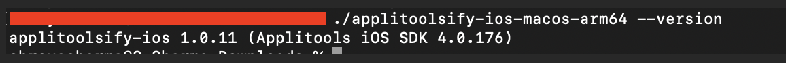

npx wdio run wdio.conf.js

Please download the latest applitoolsify version 1.0.11 from the following documentation page: https://applitools.com/docs/eyes/concepts/best-practices/native-mobile-library#ios_dynamic

When integrating with Perfecto, please do not use setMobileCapabilities or setEyesCapabilities for now. As a temporary workaround, configure the capabilities directly in the WebdriverIO configuration until next SDK update which supports shortened path